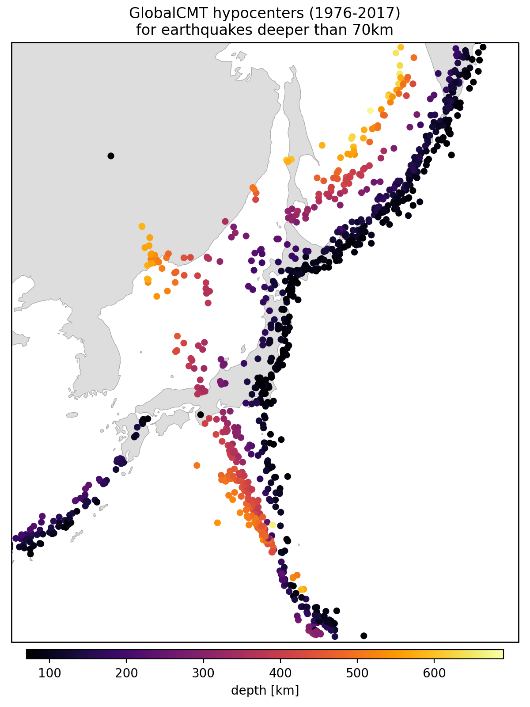

<!--
-------------------------------------------------------------------------------
This file defines the contents of each slide.
The reveal.js configuration can be found in index.html
-------------------------------------------------------------------------------
-->

<!-- .slide: class="slide-title" data-background-color="#262626" data-background-size="contain" -->

<!-- Place the content at the bottom of the slide -->
<div class="r-stretch">
</div>

<h1 id="talk-title">
  Recursos Geotérmais
</h1>
<p id="talk-authors">
  <a>Yago M Castro</a>
</p>

<!-- Place location and date side-by-side with affiliation logos -->
<div class="row talk-info">
<div class="col-large">

<i class="fa fa-calendar-alt" style="margin: 0 10px 0 0"></i>
17 de Setembro de 2024
<span style="margin: 0 20px"></span>
Seminário  2 | Métodos Geofísicos de Exploração

<!-- Permission to reuse and CC-BY license logo -->
<i class="fa fa-camera" style="margin: 0 10px 0 0"></i>
Sinta-se à vontade para tirar capturas de tela/compartilhar/reutilizar esta apresentação
<span style="margin: 0 20px"></span>
<a href="https://creativecommons.org/licenses/by/4.0/"><i class="fab fa-creative-commons"></i><i class="fab fa-creative-commons-by" style="margin: 0 10px 0 2px"></i>CC-BY 4.0 License</a>

</div>
<div class="col-medium">

<!-- Add logos here. Need these wrappers to align them to the bottom right -->
<div class="talk-logos-container">
<div class="talk-logos">
  <a href="https://www.compgeolab.org"></a>
  <a href="https://www.iag.usp.br/"></a>
  <a href="https://www.usp.br/"></a>
</div>
</div>

</div>
</div>

===============================================================================

# Energia Geotérmica
<div class="fragment text-left">

  **Definição:** Calor natural armazenado em rochas e água dentro da Terra.

</div>

<div class="fragment text-left">

  **Ponto Principal:** Pode ser aproveitado em poços (geralmente < 3 km de profundidade) sob condições geológicas favoráveis.

</div>

  <div class="fragment text-left">
    <ul class="text-left">
      <li class="text-left"><b>Ambientes Geológicos:</b></li>
      <ul class="text-left">
        <li class="text-left">Tectonismo e vulcanismo jovens</li>
        <li class="text-left">Áreas ao longo de margens ativas de placas e pontos quentes intraplaca</li>
        </ul>
    </ul>
  </div>

===============================================================================

# Configuração Geológica dos Sistemas Geotermais

<div class="row">
  <div class="col">


  
  <div class=" text-left small">
      <ul class="text-left">
        <li class="text-left"><b>Componentes:</b> Fonte de calor, água subterrânea para transporte de calor, reservatório selado</li>
        <li class="text-left"><b>Características Associadas:</b> Controles tectônicos</li>
      </ul>

  </div>

  </div>

  <div class=" col-large tiny grid" style="  justify-content: center; align-items: center;">
    
  </div>
</div>

<div class="footnote tiny">

[Meju (2002)](https://link.springer.com/article/10.1023/A:1015052419222)


</div>

===============================================================================

# Configuração Geológica dos Sistemas Geotermais

<div class="row">
  <div class="col">
    <div class=" text-left small">
        <ul class="text-left">
        <li> Em alguns recursos geotérmicos de alta temperatura associados ao vulcanismo, <b>não há uma camada selamento</b></li>
        <ul>
          <li>Os reservatórios são sistemas ativos, com entrada e saída de calor e fluido, mantendo um <b>quase-equilíbrio estático</b> com o ambiente</li>
        </ul>
    </div>
  </div>
  <div class=" col-large tiny grid" style="  justify-content: center; align-items: center;">
    
  </div>
</div>

<div class="footnote tiny">

[Meju (2002)](https://link.springer.com/article/10.1023/A:1015052419222)

</div>

===============================================================================
# Configuração Geológica dos Sistemas Geotermais

<div class="row">
  <div class="col">
  <div class=" text-left small">
      <ul class="text-left">
        <li> A <b>alteração argílica</b> geralmente encontrada na superfície dos reservatórios tende a reduzir a permeabilidade, mas <b>não impede a circulação completa do sistema</b></li>
        <li> A maioria dos sistemas geotérmicos dominados por líquidos de alta temperatura é caracterizada por uma circulação convectiva única. <b>O fluido meteórico não recircula</b> (T.G. Caldwell, comunicação pessoal, 2001).
      </ul>

  </div>

  </div>

  <div class=" col-large tiny grid" style="  justify-content: center; align-items: center;">
    
  </div>
</div>

<div class="footnote tiny">
  [Meju (2002)](https://link.springer.com/article/10.1023/A:1015052419222)
</div>

===============================================================================
# Tipos de Recursos Geotermais


  <ul class="text-left">
    <li class="text-left">Recursos Hospedados em Sedimentos Não Vulcânicos</li>
    <li class="text-left">Recursos Associados a Magmas/Vulcanismo</li>
  </ul>

===============================================================================

# Recursos Geotermais Não Vulcânicos

- **Calor Redistribuído em Aquíferos Regionais** *(Muffler, 1975)*
  - **Tipos de Reservatórios Geotermais:**
    1. **Ambientes de baixa porosidade e alta condutividade térmica**
    2. **Ambientes de baixa porosidade com circulação de água meteórica** – Circulação profunda de água ao longo de falhas e fraturas
    3. **Ambientes de alta porosidade e convectivos** – Pressão hidrostática
    4. **Recursos geopressurizados** – Ambientes convectivos com pressão acima da hidrostática

===============================================================================

# **Recursos Geotermais Vulcânicos**
- **Relacionados ao Vulcanismo ou Intrusões Ígneas** *(Muffler, 1975)*
  - **Tipos de Recursos:**
    - Sistemas convectivos hidrotermais
    - Magmas ou fusões parciais
    - Rochas quentes e secas

===============================================================================
# **Distribuição Geográfica dos Recursos Geotermais**
- **Regiões com Potencial para Recursos geotermais Relacionados ao Magma:**
  - Zonas de expansão, bacias intra-arco, zonas de subducção e pontos quentes
  - **Exemplos em Zonas de Subducção:**
    - Costa oeste da América do Sul
    - Cinturão Geotérmico do Himalaia
  - **Zonas de Rift:** *(ex.: Rift Africano Oriental, Rift do Rio Grande)*  
    - Condições para **formação de células convectivas**: rochas fraturadas e brechadas  
    - **Fonte de Calor:** regiões com vulcanismo associado

===============================================================================

# **Melhorias de Reservatório por Falhamentos**
- **Falhas subsidiárias e dinâmicas de rifteamento** *(Warner, 1975)*:
  - Direcionam águas meteóricas para as fontes de calor
  - Aumentam a permeabilidade com fraturamento contínuo e rotação das rochas do reservatório


===============================================================================

# Efeitos do Transporte de Fluido e Calor
1. **Lixiviação de Minerais Primários**:Formação de **assembléias minerais secundárias** estáveis no ambiente hidrotermal resultante.

2. **Modificação das Propriedades Físicas das Rochas do Reservatório**
   - **Permeabilidade** alterada especialmente por:
     - **Alteração argílica**: devido a altas temperaturas e fluidos ácidos
     - **Silicificação**: precipitação de sílica conforme o calor é removido dos fluidos ascendentes
     - **Densificação**: metamorfismo hidrotermal de baixa intensidade

3. **Formação de Estruturas de Descarga na Superfície**: fumarolas, fontes termais e áreas de solo fumegante


===============================================================================

# Características Específicas dos Sistemas Geotérmicos Associados a Ambientes Vulcânicos de Alta Temperatura
- Alteração hidrotermal de **argila** em rochas vulcânicas recentes.
- Presença de **águas geotérmicas levemente ácidas e salinas**.
- **Altas temperaturas** que reduzem a resistividade da subsuperfície.
- Possível **mineralização do sistema geotérmico** *(ex.: Goff e Gardner, 1994)*.

===============================================================================


### **Mapeamento Geofísico de Sistemas Geotérmicos**
- A combinação desses processos torna a **extensão superficial dos sistemas geotérmicos de alta temperatura facilmente mapeável eletricamente**.

===============================================================================

<!-- .slide: class="slide" data-background-color="#262626" data-background-size="contain" -->

# RESISTIVIDADE PARA A CARACTERIZAÇÃO DE RECURSOS GEOTERMAIS


===============================================================================

<!-- .slide: data-background-image="assets/thermal_characteristics.png" data-background-size="contain" data-background-color="#000000" -->

===============================================================================

# Maths

This is an inline $\int_a^b x^2 dx$ and $\delta g = g - \gamma$:

`\[ \int_a^b x^2 dx \]`

===============================================================================

<!-- .slide: data-background-image="assets/agu2019.svg" data-background-size="contain" data-background-opacity="0.3" data-background-color="#000000" -->

<div class="quote">

Big quote message with a faded background image.
Bla bla bla bla bla bla bla bla bla bla bla bla bla bla bla.

</div>

===============================================================================

<!-- .slide: data-background-image="assets/agu2019.svg" data-background-size="contain" data-background-opacity="0.3" data-background-color="#ffffff" -->

<div class="quote dark">

Light fade of the background with a dark quote.

</div>

===============================================================================

# Two column layout

<div class="row">
<div class="col">

## Theory

Explain something here.
This is how you make a FontAwesome list:

<ul class="fa-ul">

<li>
<span class="fa-li"> <i class="fa fa-lightbulb fa-fw"></i> </span>
Make a list with
</li>

<li>
<span class="fa-li"> <i class="fa fa-file-alt fa-fw"></i> </span>
some awesome icons
</li>

<li>
<span class="fa-li"> <i class="fa fa-users fa-fw"></i> </span>
instead of bullet points
</li>

</ul>

</div>
<div class="col tiny">


Some text explaining the figure.
Maybe even a bit of maths like $\gamma$.

</div>
</div>

<div class="footnote">

Good place for a citation or image credit.
This one is by Leonardo Uieda (CC-BY).

</div>

===============================================================================

<div class="r-stretch centered">
<div>

# Multiple columns

Place as many `col`s as you want. They will have the same size.

<div class="row">
<div class="col">

Bla bla bla bla bla bla bla bla bla bla bla bla bla bla bla bla bla bla bla bla
bla bla.

</div>
<div class="col tiny">


Bla bla bla bla bla bla bla bla bla bla bla bla bla bla bla bla bla bla bla bla
bla bla.

</div>
<div class="col tiny">


Bla bla bla bla bla bla bla bla bla bla bla bla bla bla bla bla bla bla bla bla
bla bla.

</div>
</div>

</div>
</div>
<div class="footnote">

Images by Leonardo Uieda (CC-BY).

</div>

===============================================================================

# This one has columns of different size

<div class="row">
<div class="col-large tiny">


This way the image is larger on the screen. Use it for maps or main figures.

</div>
<div class="col small">

Explain what is shown on the image.
Use the `small` class to adjust font size.

Maybe include some maths:

$ D\dfrac{\partial^4 w}{\partial x^4} = q - g (\rho_m - \rho_w) w $

</div>
</div>

===============================================================================

<div class="row">
<div class="col tiny">



This way the image is narrow so it should be in a smaller column.

</div>
<div class="col-medium">

# Column sizes

Columns come in 3 sizes:

1. `col`
1. `col-medium`
1. `col-large`

These are more proportions than fixed sizes.

</div>
</div>

===============================================================================

# Code

Example of using PyGMT to make a map:

<div class="row">
<div class="col-large fragment small">

This code:

```python
import pygmt

# Load built-in topography data
grid = pygmt.datasets.load_earth_relief()

fig = pygmt.Figure()
# Pseudo-color map of topography
fig.basemap(
    region=[-150, -30, -60, 60],
    projection="I-90/6i",
    frame=True,
)
fig.grdimage(grid=grid, cmap="viridis")
# Mask continents in dark grey
fig.coast(land="#333333")
# Display in Jupyter or pop-up window
fig.show()
```
</div>
<div class="col-medium fragment small">

Makes this map 👇


</div>

===============================================================================

<!-- .slide: class="slide-contact" data-background-image="assets/contact-slide.svg" data-background-size="contain" data-background-color="#000000" -->

<div class="r-stretch centered">
<div>

<i class="fas fa-comments"></i>
<br>
Contact:
<a href="https://www.leouieda.com">www.leouieda.com</a>

<i class="fab fa-github"></i>
<br>
Source code for this presentation:
<br>
[github.com/leouieda/talk-template](https://github.com/leouieda/talk-template)

<i class="fab fa-creative-commons"></i><i class="fab fa-creative-commons-by"></i>
<br>
Unless otherwise noted,
the contents of this presentation are
licensed under the
<br>
[Creative Commons Attribution 4.0 International License](https://creativecommons.org/licenses/by/4.0/).

</div>
</div>
<div class="footnote-left dark">

The background image is a Landsat 9 scene of the city of São Paulo, Brazil,
showing the USP campus in the center.

</div>
