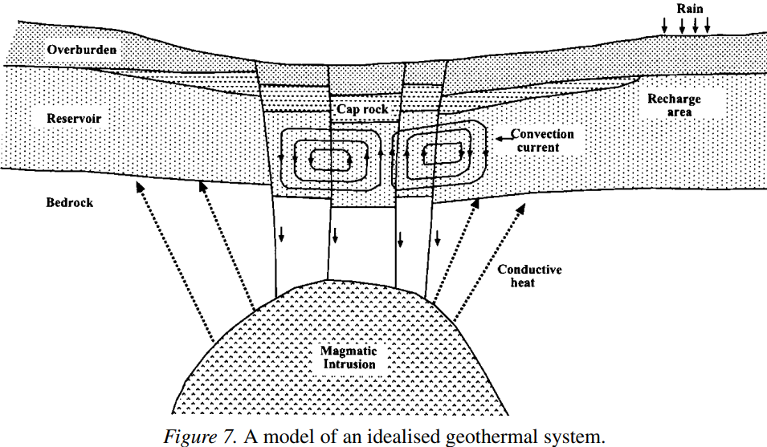
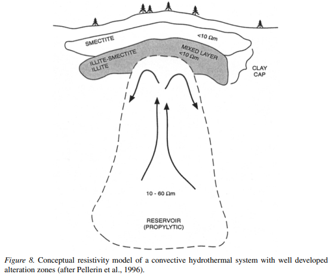

<!--
-------------------------------------------------------------------------------
This file defines the contents of each slide.
The reveal.js configuration can be found in index.html
-------------------------------------------------------------------------------
-->

<!-- .slide: class="slide-title" data-background-color="#262626" data-background-size="contain" -->

<!-- Place the content at the bottom of the slide -->

<h1 id="talk-title">
  Recursos Geotérmais
</h1>

  <a>Yago M Castro</a>

<!-- Place location and date side-by-side with affiliation logos -->

<i class="fa fa-calendar-alt" style="margin: 0 10px 0 0"></i>
30 de Outubro de 2024

Seminário  2 | Métodos Geofísicos de Exploração

<!-- Permission to reuse and CC-BY license logo -->
<i class="fa fa-camera" style="margin: 0 10px 0 0"></i>
Sinta-se à vontade para tirar capturas de tela/compartilhar/reutilizar esta apresentação

<a href="https://creativecommons.org/licenses/by/4.0/"><i class="fab fa-creative-commons"></i><i class="fab fa-creative-commons-by" style="margin: 0 10px 0 2px"></i>CC-BY 4.0 License</a>

<!-- Add logos here. Need these wrappers to align them to the bottom right -->

  
  
  

===============================================================================

# Energia Geotermal

  **Definição:** Calor natural armazenado em rochas e água dentro da Terra.

  **Ponto Principal:** Pode ser aproveitado em poços (geralmente < 3 km de profundidade) sob condições geológicas favoráveis.

  

    <ul class="text-left">
      <li class="text-left"><b>Ambientes Geológicos:</b></li>
      <ul class="text-left">
        <li class="text-left">Tectonismo e vulcanismo jovens</li>
        <li class="text-left">Áreas ao longo de margens ativas de placas e pontos quentes intraplaca</li>
        </ul>
    </ul>
  

===============================================================================

# Configuração Geológica dos Sistemas Geotermais

  

  
  

      <ul class="text-left">
        <li class="text-left"><b>Componentes:</b> Fonte de calor, água subterrânea para transporte de calor, reservatório selado</li>
        <li class="text-left"><b>Características Associadas:</b> Controles tectônicos</li>
        <li> Em alguns recursos geotermais de alta temperatura associados ao vulcanismo, <b>não há uma camada selamento</b></li>
        <ul>
          <li>Os reservatórios são sistemas ativos, com entrada e saída de calor e fluido, mantendo um <b>quase-equilíbrio estático</b> com o ambiente</li>
        </ul>
      </ul>

  

  

  

    
  

[Meju (2002)](https://link.springer.com/article/10.1023/A:1015052419222)

===============================================================================

# Configuração Geológica dos Sistemas Geotermais

  

    

        <ul class="text-left">
          <li> A <b>alteração argílica</b> geralmente encontrada na superfície dos reservatórios tende a reduzir a permeabilidade, mas <b>não impede a circulação completa do sistema</b></li>
          <li> A maioria dos sistemas geotermais dominados por líquidos de alta temperatura é caracterizada por uma circulação convectiva única. <b>O fluido meteórico não recircula</b> (T.G. Caldwell, comunicação pessoal, 2001).
        </ul>
    

  

  

    
  

  [Meju (2002)](https://link.springer.com/article/10.1023/A:1015052419222)

===============================================================================
# Tipos de Recursos Geotermais

<ul class="text-left">
  <li class="text-left">Recursos Hospedados em Sedimentos Não Vulcânicos</li>
  <li class="text-left">Recursos Associados a Magmas/Vulcanismo</li>
</ul>

===============================================================================

# Recursos Geotermais Não Vulcânicos

- **Calor Redistribuído em Aquíferos Regionais** *(Muffler, 1975)*
  - **Tipos de Reservatórios Geotermais:**
    1. **Ambientes de baixa porosidade e alta condutividade térmica**
    2. **Ambientes de baixa porosidade com circulação de água meteórica** – Circulação profunda de água ao longo de falhas e fraturas
    3. **Ambientes de alta porosidade e convectivos** – Pressão hidrostática
    4. **Recursos geopressurizados** – Ambientes convectivos com pressão acima da hidrostática

===============================================================================

# **Recursos Geotermais Vulcânicos**
- **Relacionados ao Vulcanismo ou Intrusões Ígneas** *(Muffler, 1975)*
  - **Tipos de Recursos:**
    - Sistemas convectivos hidrotermais
    - Magmas ou fusões parciais
    - Rochas quentes e secas

===============================================================================
# **Distribuição Geográfica dos Recursos Geotermais**
- **Regiões com Potencial para Recursos geotermais Relacionados ao Magma:**
  - Zonas de expansão, bacias intra-arco, zonas de subducção e pontos quentes
  - **Exemplos em Zonas de Subducção:**
    - Costa oeste da América do Sul
    - Cinturão Geotermal do Himalaia
  - **Zonas de Rift:** *(ex.: Rift Africano Oriental, Rift do Rio Grande)*  
    - Condições para **formação de células convectivas**: rochas fraturadas e brechadas  
    - **Fonte de Calor:** regiões com vulcanismo associado

===============================================================================

# **Melhorias de Reservatório por Falhamentos**
- **Falhas subsidiárias e dinâmicas de rifteamento** *(Warner, 1975)*:
  - Direcionam águas meteóricas para as fontes de calor
  - Aumentam a permeabilidade com fraturamento contínuo e rotação das rochas do reservatório

===============================================================================

# Efeitos do Transporte de Fluido e Calor
1. **Lixiviação de Minerais Primários**:Formação de **assembléias minerais secundárias** estáveis no ambiente hidrotermal resultante.

2. **Modificação das Propriedades Físicas das Rochas do Reservatório**
   - **Permeabilidade** alterada especialmente por:
     - **Alteração argílica**: devido a altas temperaturas e fluidos ácidos
     - **Silicificação**: precipitação de sílica conforme o calor é removido dos fluidos ascendentes
     - **Densificação**: metamorfismo hidrotermal de baixa intensidade

3. **Formação de Estruturas de Descarga na Superfície**: fumarolas, fontes termais e áreas de solo fumegante

===============================================================================

# Características Específicas dos Sistemas Geotermais Associados a Ambientes Vulcânicos de Alta Temperatura
- Alteração hidrotermal de **argila** em rochas vulcânicas recentes.
- Presença de **águas geotermais levemente ácidas e salinas**.
- **Altas temperaturas** que reduzem a resistividade da subsuperfície.
- Possível **mineralização do sistema geotermal** *(ex.: Goff e Gardner, 1994)*.

===============================================================================

### **Mapeamento Geofísico de Sistemas Geotermais**
- A combinação desses processos torna a **extensão superficial dos sistemas geotermais de alta temperatura facilmente mapeável eletricamente**.

===============================================================================

<!-- .slide: class="slide" data-background-color="#262626" data-background-size="contain" -->

# RESISTIVIDADE PARA A CARACTERIZAÇÃO DE RECURSOS GEOTERMAIS

===============================================================================

<!-- .slide: data-background-image="assets/thermal_characteristics.png" data-background-size="contain" data-background-color="#000000" -->

===============================================================================

# Relação Condutividade-Temperatura
  - Em altas temperaturas:
    `\[
    σ = σ_i \, \exp\left(-\frac{E_i}{\kappa T}\right)
    \]`   
    - \( σ \): condutividade elétrica
    - \( T \): temperatura (K)
    - \( $\kappa$ \): constante de Boltzmann
    - \( E_i \): energia de ativação
    - \( $σ_i$ \): constante dependente do mecanismo de condução (impurezas, intrínseco ou iônico).

===============================================================================
# Relação Condutividade-Temperatura
  - Em altas temperaturas:
    `\[
    σ = σ_i \, \exp\left(-\frac{E_i}{\kappa T}\right)
    \]`

- **Importante**: A condução sólida em minerais torna-se irrelevante a temperaturas **abaixo de 700 °C**.

===============================================================================
# Gradiente Geotermal e Profundidade
A temperatura também pode ser estimada em função do **gradiente geotermal** (s) e da **profundidade** (z), conforme (Petrick et al., 1977):
  `\[
  T = sz + 300
  \]`

===============================================================================

# Resistividade em Fluidos Geotermais

- **Resistividades**: entre 0,01 e 10 Ω·m *(Moskowitz e Norton, 1977)*.
- Relação direta entre **condutividade elétrica e temperatura da rocha** ou entre condutividade elétrica da rocha e seus fluidos saturantes *(Archie, 1942)*.

===============================================================================

<!-- .slide: class="slide" data-background-color="#262626" data-background-size="contain" -->

# Métodos geoelétricos são indicados para a **exploração geotermal**.

===============================================================================

# Manifestações Geotermais e Resistividade

  

  
  

    <ul class="text-left">
      <li class="text-left"><b>Baixa Resistividade:</b> caracteriza a posição de muitas manifestações geotermais (Berktold, 1983; Wright et al., 1985; Strack et al., 1990; Martinez-Garcia, 1992)</li>
      <li class="text-left"><b>Alterações hidrotermais:</b></li>
      <ul class="text-left">
        <li class="text-left">Formação de <b>argilas condutivas</b> (ex.: ilita, esmectita, montmorilonita) ou <b>densificação</b> dos sedimentos.</li>
        <li class="text-left">Estabelecimento de uma <b>zonagem identificável de mineralogia e resistividade</b> no reservatório.</li>
      </ul>
    </ul>
    

  

  

    
  

[Meju (2002)](https://link.springer.com/article/10.1023/A:1015052419222)

===============================================================================

# Manifestações Geotermais e Resistividade

  

  
  

    <ul class="text-left">
      <li class="text-left"><b>Zona central:</b> núcleo cilíndrico ou oval de <b>alteração sericítica ou propilítica</b> (dependendo do material hospedeiro)</li>
      <li class="text-left"><b>Envelope de Argilas:</b> apresenta baixa resistividade e forma uma camada de selamento</li>
      <ul>
        <li class="text-left"><b>Notas:</b>  o reservatório geralmente tem resistividade maior que a camada de argila, mas nem sempre</li>
      </ul>
    </ul>
    

  

  

    
  

[Meju (2002)](https://link.springer.com/article/10.1023/A:1015052419222)

===============================================================================

<!-- .slide: data-background-image="assets/gem-methods.png" data-background-size="contain" data-background-color="#000000" -->

===============================================================================

# Principais Desafios na Prospecção Geotermal

**Complexidade 3D dos Sistemas Geotermals**
- **Natureza Tridimensional**: sistemas geotermais possuem uma estrutura tridimensional complexa.
- **Alta Densidade de Pontos de Medição**: é necessário um grande número de sondagens em profundidade para gerar imagens detalhadas do subsolo.

===============================================================================

# Principais Desafios na Prospecção Geotermal

**Aumento da Produtividade e Redução de Custos**
- **Desafios em Aquisição de Dados**: desenvolver métodos para aumentar a eficiência de coleta de dados em campo.
- **Software 3D**: há necessidade de ferramentas de software aprimoradas para modelagem tridimensional.
- **Redução de Custos**: busca por técnicas mais econômicas para tornar a exploração geotermal viável.

===============================================================================

# Principais Desafios na Prospecção Geotermal

**Avanços nos Sistemas Multi-Canais MT/EMAP**
  - **Sistemas Multi-Canais**: o uso de sistemas multi-canais MT/EMAP é uma inovação importante na exploração geotermal com métodos eletromagnéticos.
  - **Fontes Ativas Multi-Polarização**: técnicas de fonte ativa com múltiplas polarizações podem aumentar a produtividade de dados, mas exigem desenvolvimento de códigos de cálculo avançados para fontes não-plane-wave.

===============================================================================

# Principais Desafios na Prospecção Geotermal

**Desafios Específicos em Sistemas Neovulcânicos**
- **Mapeamento de Zonas de Alteração**: é especialmente desafiador em sistemas neovulcânicos, onde a atividade hidrotermal é intensa.
- **Previsão de Temperaturas de Base**: uma tarefa complexa, essencial para entender o potencial energético do sistema.
- **Dados Auxiliares para Projeto de Poços**: coletar informações para otimizar o espaçamento de poços e taxas de bombeamento.

===============================================================================

<!-- .slide: data-background-color="#262626" data-background-size="contain" -->

<i class="fas fa-comments"></i>
 
Contato:
<a href="yagomcastro@usp.br">yagomcastro@usp.br</a>

<i class="fab fa-github"></i>
 
Código-fonte para esta apresentação:
 
[github.com/YagoMCastro/tectonica-litosfera-seminario1-msc-2024](https://github.com/YagoMCastro/tectonica-litosfera-seminario1-msc-2024)

<i class="fab fa-creative-commons"></i><i class="fab fa-creative-commons-by"></i>
 

Salvo indicação em contrário,
o conteúdo desta apresentação está
licenciado sob a
 
[Creative Commons Attribution 4.0 International License](https://creativecommons.org/licenses/by/4.0/).

